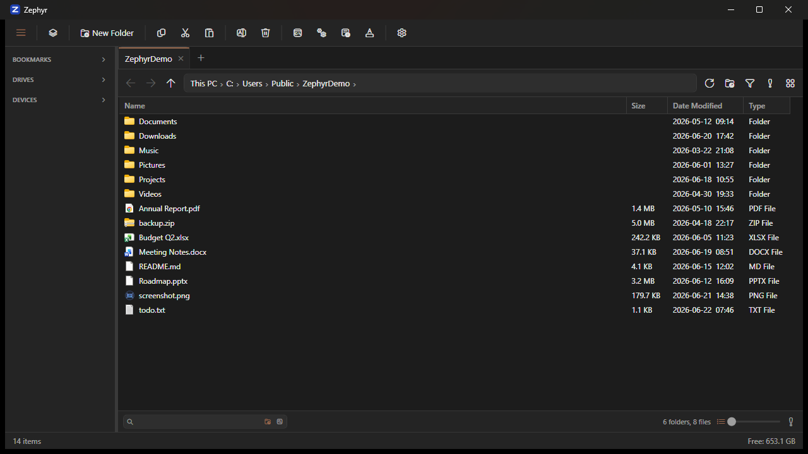

# Zephyr

Zephyr is a fast, keyboard-friendly file manager for Windows 11 — with tabs, split-pane browsing, built-in archive support, and folder locking, all wrapped in a clean, theme-matched interface that actually feels like part of the OS.

<p align="center">
  
</p>

## Features

### Browsing & navigation
- **Tabbed browsing** with a breadcrumb path bar and full navigation history (back / forward / up).
- **Split / dual-pane view** for working across two locations at once.
- **Tear-off tabs** — drag a tab out into its own window.
- **Details and thumbnail/icon views** with an adjustable thumbnail size.
- **Flat view** to flatten a folder tree and see every file at once.
- **Filter bar** for quickly narrowing the current folder.
- **Search** across the current location, including recursive deep search.
- **Session restore** reopens your tabs and panes on launch.

### File operations
- **Transfer manager** — queued copy/move with live progress, plus pause, resume, and cancel.
- **Undo** for file operations.
- **Recycle Bin and permanent delete** (Shift+Del).
- **Batch rename** for renaming many files at once.
- **Command palette** for quick, keyboard-driven actions.

### Archives
- **Browse inside** `.zip` and other archives as if they were folders.
- **Compress and extract** with progress, including encrypted (AES) zips.

### Windows integration
- **Win+E integration** — register Zephyr as the default handler so Win+E opens it instead of Explorer.
- **Integrated terminal** — open a terminal at the current folder (Ctrl+`).
- **Shell integration** — native context menus and file icons.
- **Portable device support** (MTP / WPD) for phones and cameras.
- **Cloud sync badges** for OneDrive and other synced folders.

### Display & privacy
- **Folder Lock** — gate individual folders behind a password for the session.
- **Preview pane** for images, text, and PDF documents.
- **Thumbnails** with caching for fast, smooth scrolling.
- **Quick Access, bookmarks, and recent files** for jumping to what you use most.
- **Show/hide hidden & system files** and **file extensions**.
- **Optional folder sizes** in the listing.
- **Light and dark themes** that match the rest of the Windows 11 shell.
- **Configurable startup folder**, launch-maximized, and more.

## Tech stack

- **C# / WPF** on **.NET 10** (`net10.0-windows10.0.22621.0`)
- MVVM via [CommunityToolkit.Mvvm](https://github.com/CommunityToolkit/dotnet)
- Archives: [SharpCompress](https://github.com/adamhathcock/sharpcompress) (read) + [SharpZipLib](https://github.com/icsharpcode/SharpZipLib) (encrypted-zip write)
- PDF rendering: [PdfPig](https://github.com/UglyToad/PdfPig)

## Requirements

- **Windows 11** (build 22621 / 22H2 or later)
- **To run:** nothing extra — release builds are self-contained and bundle the .NET runtime
- **To build from source:** the [.NET 10 SDK](https://dotnet.microsoft.com/download)

## Building

```sh
dotnet build -c Release
```

## Running

```sh
dotnet run --project Zephyr.UI/Zephyr.UI.csproj
```

Or launch the built executable without a console window via `run.vbs` (it resolves the path relative to itself, so it works from any clone location).

## Project layout

| Project | Description |
|---------|-------------|
| `Zephyr.UI` | WPF front end — views, view models, controls, dialogs, themes, and services. |
| `Zephyr.Core` | Core logic — file system, archives, search, security (folder lock), settings, and models. |
| `Zephyr.Tests` | Unit tests. |
